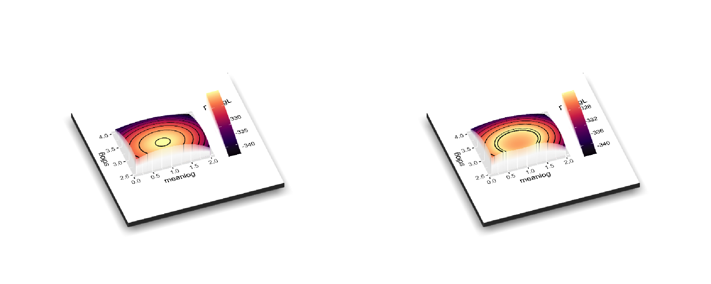
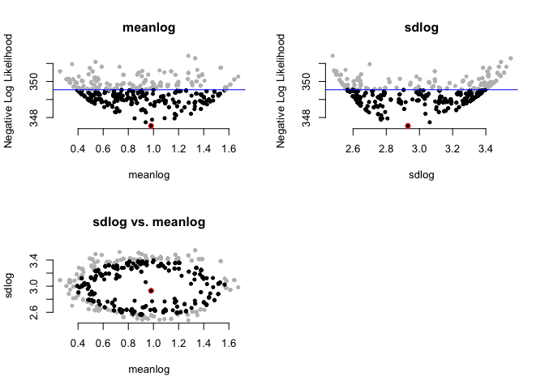

<!-- README.md is generated from README.Rmd. Please edit that file -->

# dentist

<!-- badges: start -->
<!-- badges: end -->

`dentist` is an R package to sample points around a specified distance
from the maximum likelihood estimates. This should be a better way to
estimate uncertainty than using the Hessian of the likelihood equation.
It works by “denting” the likelihood surface to make a ridge at your
desired ∆lnL and then “walks” around this dented surface, sampling
points.

## Installation

And the development version from [GitHub](https://github.com/) with:

``` r
# install.packages("devtools")
devtools::install_github("bomeara/dentist")
```

## Example

Imagine we had empirical data from some distribution:

``` r
sims <- stats::rlnorm(100, meanlog=1, sdlog=3)
```

We could write a function for the likelihood of the data and optimize
this function:

``` r
# Define the likelihood function

 dlnorm_to_run <- function(par, sims) {
   return(-sum(stats::dlnorm(sims, meanlog=par[1], sdlog=par[2], log=TRUE)))
 }
 
 # Optimize the model given the empirical data. We guess at the starting values
 optimized_results <- stats::optim(c(meanlog=.5, sdlog=1), dlnorm_to_run, sims=sims)
 best_par <- optimized_results$par
 best_neglnL <- optimized_results$value
```

That gives us a point estimate of the best values:

``` r
print(best_par)
#>   meanlog     sdlog 
#> 0.9812228 2.9305144
```

But how confident should we be? For familiar distributions like a
binomial distribution we can compute the confidence interval for a
parameter estimate. For less familiar ones, we can approximate it using
the curvature at the peak. Another approach is to vary one parameter at
a time while holding others at their maximum likelihood estimate until
the likelihood gets much worse (typically a cutoff of ∆2 log likelihood
units is used). That can underestimate the uncertainty, since there
could be a ridge in parameter space. A better approach would be to try
many values and return all those within some specified likelihood
bounds. This could be done with latin hypercubes, but it can be a large
part of parameter space to explore. A different approach would be to
focus on sampling points right at the boundary of “good enough.” This
package does this. If a likelihood surface is a peak, this package wants
to sample points around a specified height below the peak to fully
sample the uncertainty. It does it by “walking” with a
Metropolis-Hastings algorithm around a dented likelihood surface, so
that values better than the ideal threshold are reflected back. First,
to show how the original surface (left) is dented (right):

    #> Scale for 'fill' is already present. Adding another scale for 'fill', which
    #> will replace the existing scale.
    #> Warning: Removed 1992 row(s) containing missing values (geom_path).
    #> Scale for 'fill' is already present. Adding another scale for 'fill', which
    #> will replace the existing scale.
    #> Warning: Removed 2006 row(s) containing missing values (geom_path).



Note that for plotting, it’s shown with the regular log likelihood:
typically values &lt;&lt; 0, and higher is better. In the package, it
wants you to use negative log likelihood, so it would be the mirror
image of these plots (lower better).

And now to sample around that ring on the right:

``` r
library(dentist)
 dented_results <- dent_walk(par=best_par, fn=dlnorm_to_run, best_neglnL=best_neglnL,  nsteps=1000, sims=sims)
#> [1] "Done replicate 50"
#> [1] "CI of values"
#>            X1        X2       X3
#> [1,] 347.5408 0.8511306 2.567469
#> [2,] 349.4909 1.1874057 2.930514
#> [1] "Done replicate 100"
#> [1] "CI of values"
#>            X1        X2       X3
#> [1,] 347.5408 0.5038479 2.567469
#> [2,] 349.4926 1.1874057 3.319883
#> [1] "Done replicate 150"
#> [1] "CI of values"
#>            X1        X2       X3
#> [1,] 347.5408 0.5038479 2.567469
#> [2,] 349.4926 1.1874057 3.372017
#> [1] "Done replicate 200"
#> [1] "CI of values"
#>            X1        X2       X3
#> [1,] 347.5408 0.3939221 2.566562
#> [2,] 349.5174 1.1874057 3.372017
#> [1] "Done replicate 250"
#> [1] "CI of values"
#>            X1        X2       X3
#> [1,] 347.5408 0.3939221 2.566562
#> [2,] 349.5174 1.5657412 3.372017
#> [1] "Done replicate 300"
#> [1] "CI of values"
#>            X1        X2       X3
#> [1,] 347.5408 0.3939221 2.566562
#> [2,] 349.5174 1.5657412 3.378537
#> [1] "Done replicate 350"
#> [1] "CI of values"
#>            X1        X2       X3
#> [1,] 347.5408 0.3939221 2.566562
#> [2,] 349.5174 1.5657412 3.378537
#> [1] "Done replicate 400"
#> [1] "CI of values"
#>            X1        X2       X3
#> [1,] 347.5408 0.3939221 2.566562
#> [2,] 349.5308 1.5657412 3.378537
#> [1] "Done replicate 450"
#> [1] "CI of values"
#>            X1        X2       X3
#> [1,] 347.5408 0.3939221 2.566562
#> [2,] 349.5308 1.5657412 3.378537
#> [1] "Done replicate 500"
#> [1] "CI of values"
#>            X1        X2       X3
#> [1,] 347.5408 0.3939221 2.566562
#> [2,] 349.5308 1.5657412 3.378537
#> [1] "Done replicate 550"
#> [1] "CI of values"
#>            X1        X2       X3
#> [1,] 347.5408 0.3939221 2.566562
#> [2,] 349.5308 1.5657412 3.378537
#> [1] "Done replicate 600"
#> [1] "CI of values"
#>            X1        X2       X3
#> [1,] 347.5408 0.3939221 2.566562
#> [2,] 349.5308 1.5657412 3.378537
#> [1] "Done replicate 650"
#> [1] "CI of values"
#>            X1        X2       X3
#> [1,] 347.5408 0.3939221 2.566562
#> [2,] 349.5308 1.5657412 3.378537
#> [1] "Done replicate 700"
#> [1] "CI of values"
#>            X1        X2       X3
#> [1,] 347.5408 0.3939221 2.566562
#> [2,] 349.5308 1.5657412 3.378537
#> [1] "Done replicate 750"
#> [1] "CI of values"
#>            X1        X2       X3
#> [1,] 347.5408 0.3939221 2.566562
#> [2,] 349.5308 1.5657412 3.378537
#> [1] "Done replicate 800"
#> [1] "CI of values"
#>            X1        X2       X3
#> [1,] 347.5408 0.3939221 2.566562
#> [2,] 349.5308 1.5657412 3.378537
#> [1] "Done replicate 850"
#> [1] "CI of values"
#>            X1        X2       X3
#> [1,] 347.5408 0.3939221 2.566562
#> [2,] 349.5308 1.5657412 3.396274
#> [1] "Done replicate 900"
#> [1] "CI of values"
#>            X1        X2       X3
#> [1,] 347.5408 0.3939221 2.566562
#> [2,] 349.5308 1.5657412 3.396274
#> [1] "Done replicate 950"
#> [1] "CI of values"
#>            X1        X2       X3
#> [1,] 347.5408 0.3939221 2.566562
#> [2,] 349.5308 1.5657412 3.396274
#> [1] "Done replicate 1000"
#> [1] "CI of values"
#>            X1        X2       X3
#> [1,] 347.5408 0.3939221 2.566562
#> [2,] 349.5308 1.5657412 3.396274
```

This generates information about the confidence:

``` r
print(dented_results)
#> This ran 1000 steps looking for all points within 2 negative log likelihood units of the best parameter values.
#> 
#> Parameters: 
#>                    meanlog    sdlog
#> best             0.9812228 2.930514
#> lower.CI         0.3939221 2.566562
#> upper.CI         1.5657412 3.396274
#> lowest.examined  0.2573539 2.476691
#> highest.examined 1.6745565 3.550116
```

And also has a way to visualize the results:

``` r
plot(dented_results)
```



You do not need to use this package for simple distributions, but in
phylogenetics, where programs like OUwie, corHMM, hisse, OUCH, and more
give a point estimate, this lets you get confidence for the parameters
if there’s a way to have a function where you pass in a set of parameter
values and get back a negative log likelihood.
